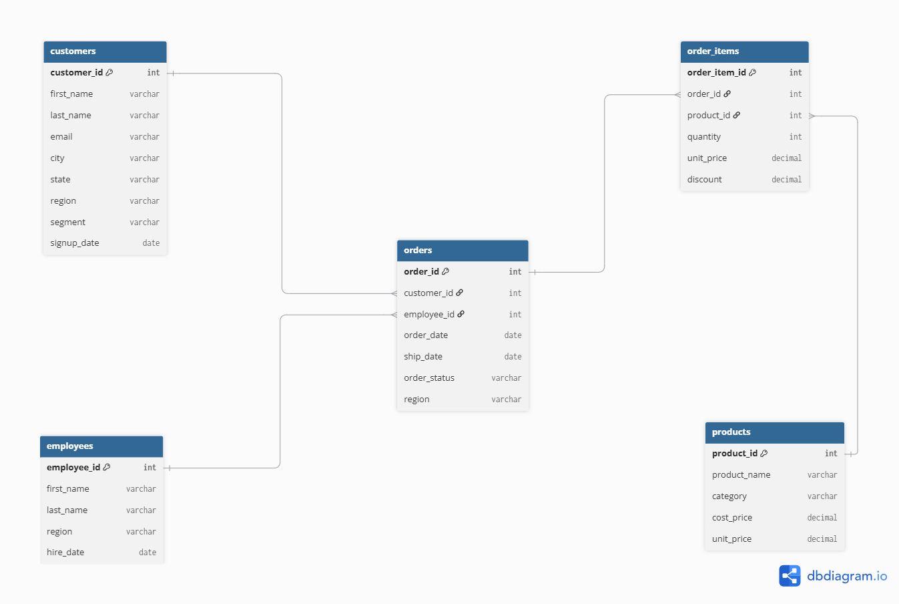

# Retail Sales Analysis — SQL Portfolio Project (MySQL)

A self-contained SQL project simulating a retail company's sales data, built to
demonstrate core Business Analyst SQL skills: schema design, joins, aggregation,
subqueries, CTEs, window functions, and views — all in MySQL 8.0.

## The business

This is a simulated retail company selling across 4 US regions (North, South,
East, West) through a small team of in-house sales reps. Customers — split into
Consumer, Corporate, and Home Office segments — place orders containing one or
more products across 5 categories (Electronics, Office Supplies, Furniture,
Home & Kitchen, Sports). The dataset covers ~11,000 rows across 2023–2024:
500 customers, 15 employees, 30 products, 3,000 orders, and 7,429 order line items.

## Data model



5 tables: `customers`, `employees`, `products`, `orders`, `order_items`.
`orders` links to `customers` and `employees`; `order_items` links to `orders`
and `products` — a standard star-like structure with `order_items` as the
transactional fact table.

## Files in this repo
- `mysql_schema.sql` — table definitions, foreign keys, indexes
- `mysql_load_data.sql` — loads the 5 CSVs via `LOAD DATA LOCAL INFILE`
- `mysql_analysis_queries.sql` — 15 business questions answered in SQL, basic → advanced
- `er_diagram.png` — visual data model
- `/data` — the 5 source CSVs
- `generate_data.py` — script that generated the synthetic dataset

## How to run it
1. Install MySQL 8.0+ and MySQL Workbench.
2. Run `mysql_schema.sql` to create the `retail_sales` database and its 5 tables.
3. Enable local file loading: `SET GLOBAL local_infile = 1;`
4. Edit the 5 file paths in `mysql_load_data.sql` to point at your local `/data` folder, then run it.
5. Run through `mysql_analysis_queries.sql` to reproduce the analysis below.

## Skills demonstrated
- **Basics** — filtering, sorting, `GROUP BY`
- **Joins & aggregation** — multi-table joins, revenue calculations, rep/region performance
- **CTEs & window functions** — running totals (`SUM() OVER`), ranking (`RANK() OVER PARTITION BY`), month-over-month growth (`LAG()`), RFM customer segmentation
- **Views** — a reusable `vw_sales_summary` view for BI tool connections

## Key insights

**Electronics drives revenue disproportionately.** Electronics generated
~$702K in revenue — roughly 40% more than the next-highest category (Home &
Kitchen at ~$411K) — despite having the same number of product listings as
every other category. This points to a small set of high-performing SKUs
worth identifying individually before making inventory or marketing decisions.

**Order problems are consistently high across all regions, not concentrated
in one place.** Cancellation + return rates range narrowly from 32.1% (West)
to 34.5% (North) — a systemic issue rather than a regional fulfillment
problem. Worth investigating product quality, checkout friction, or delivery
expectations company-wide.

**Customer segment barely affects order size, but purchase frequency does.**
Average order value is nearly flat across segments (Home Office $1,152.84,
Corporate $1,130.96, Consumer $1,116.92 — within 3% of each other). The RFM
analysis is more revealing: "Champion" customers (63 people, buying
frequently and recently) average $7,643 in lifetime spend versus $3,614 for
"At Risk" customers (191 people) — a 2x+ gap, suggesting retention and
purchase frequency matter far more than which customer segment someone
belongs to.

## Example query (RFM segmentation)
```sql
WITH customer_stats AS (
    SELECT c.customer_id,
           DATEDIFF('2025-01-01', MAX(o.order_date)) AS recency_days,
           COUNT(DISTINCT o.order_id) AS frequency,
           SUM(oi.quantity * oi.unit_price * (1 - oi.discount)) AS monetary
    FROM customers c
    JOIN orders o ON o.customer_id = c.customer_id
    JOIN order_items oi ON oi.order_id = o.order_id
    WHERE o.order_status = 'Completed'
    GROUP BY c.customer_id
)
SELECT *,
       CASE
           WHEN recency_days <= 60 AND frequency >= 5 THEN 'Champion'
           WHEN recency_days <= 120 THEN 'Active'
           WHEN recency_days > 180 THEN 'At Risk'
           ELSE 'Regular'
       END AS customer_tier
FROM customer_stats
ORDER BY monetary DESC;
```

## Tech stack
MySQL 8.0 · MySQL Workbench
